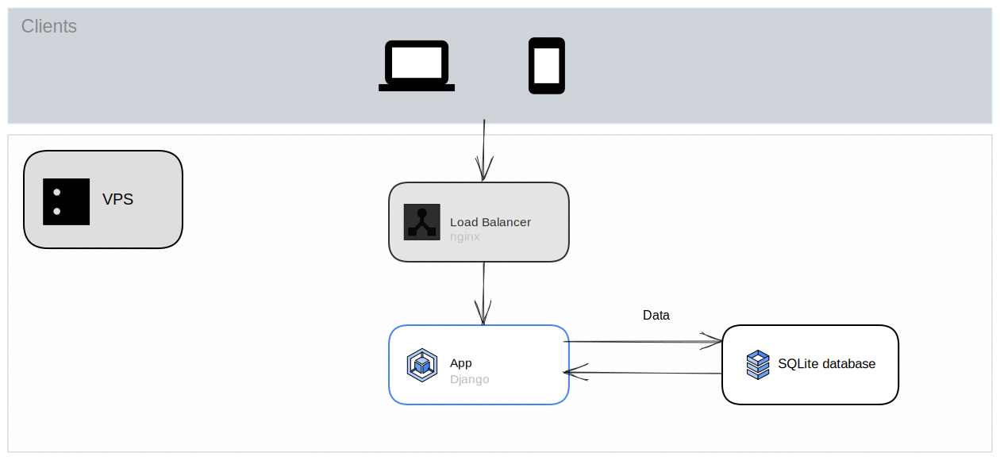

# description

SSR django app

# basic overview

Made with https://googlecloudcheatsheet.withgoogle.com/architecture

# modules

## `D1.5`

`/D1.5/login/`

`/D1.5/double/`

`/D1.5/cursive/`

- `double` - "На одной из страниц контент повторяется 2 раза без изменения content"
- `cursive` - "На одной из страниц изменены шрифты и размеры текста." и
  "... странички, в одной из которых текст полностью будет оформлен курсивом"
- `login` - "Одна из страниц на сайте доступна только админу"

## `D2.7`

[file](/project/templates/flatpages/D2.7.py)

В качестве результата задания подготовьте файл, в котором напишете список всех
команд, запускаемых в `Django shell`.

- Создать двух пользователей (с помощью метода `User.objects.create_user`).
- Создать два объекта модели `Author`, связанные с пользователями.
- Добавить 4 категории в модель `Category`.
- Добавить 2 статьи и 1 новость.
- Присвоить им категории (как минимум в одной статье/новости должно быть не
  меньше 2 категорий).
- Создать как минимум 4 комментария к разным объектам модели `Post`
  (в каждом объекте должен быть как минимум один комментарий).
- Применяя функции `like()` и `dislike()` к статьям/новостям и комментариям,
  скорректировать рейтинги этих объектов.
- Обновить рейтинги пользователей.
- Вывести `username` и рейтинг лучшего пользователя (применяя сортировку и
  возвращая поля первого объекта).
- Вывести дату добавления, `username` автора, рейтинг, заголовок и превью
  лучшей статьи, основываясь на лайках/дислайках к этой статье.
- Вывести все комментарии (дата, пользователь, рейтинг, текст) к этой статье.

## `D3.4`

`/news/`

- Сделать новую страничку с адресом `/news/`, на которой должен выводиться
  список всех новостей.
- Все статьи выведены в виде заголовка, даты и первых 50 символов текста статьи.
- Новости должны выводиться в порядке от более свежей до самой старой.
  Отображается всё по адресу `/news/`.
- Сделать отдельную страницу для полной информации о статье
  `/news/<id новости>`.
  На этой странице должна быть вся информация о статье.
  Название, текст и дата загрузки в формате `ДЕНЬ-МЕСЯЦ-ГОД ЧАС:МИНУТЫ`.
- Написать собственный фильтр `Censor`, который цензурирует нежелательную
  лексику в названиях и текстах статей.
- Все новые странички должны быть частью основного шаблона `default.html`.

## `D4.4`

`/news/`

`/news/search/`

- Усовершенствовать ваш новостной портал.
  Добавить постраничный вывод и отдельную страницу с поиском `/search/`,
  чтобы пользователь мог сортировать новости по дате и имени автора.
- Необходимо иметь возможность создавать новые новости и статьи не только из админки, но и в самом приложении.
  Для такой возможности необходимо создать модельные формы.
- Необходимо добавить на сайт с помощью дженериков новые страницы
  `/news/add/`, а также `/news/<int:pk>/edit/`.
  На этих страницах пользователь может добавить или редактировать новости.
  Добавьте страницу удаления новостей `/news/<int:pk>/delete/`.
  На ней после подтверждения пользователь может удалить страницу с новостью.

## `D5.6`

`Google` авторизация включена только для `localhost:6001`

`/accounts/login/`

`/accounts/logout/`

`/accounts/signup/`

`/` (страница пользователя)

`/news/search/`

- В классе-представлении редактирования профиля добавить проверку аутентификации.
- Выполнить необходимые настройки пакета `allauth` в файле конфигурации.
- В файле конфигурации определить адрес для перенаправления на страницу входа в систему и адрес перенаправления после успешного входа.
- Реализовать шаблон с формой входа в систему и выполнить настройку конфигурации `URL`.
- Реализовать шаблон страницы регистрации пользователей.
- Реализовать возможность регистрации через `Google`-аккаунт.
- Создать группы `common` и `authors`.
  Реализовать автоматическое добавление новых пользователей в группу common.
- Создать возможность стать автором (быть добавленным в группу `authors`).
- Для группы `authors` предоставить права создания и редактирования объектов модели `Post` (новостей и статей).
- В классах-представлениях добавления и редактирования новостей и статей добавить проверку прав доступа.

## `D6.5`

`/news/category/<str:category>`

- Усовершенствуйте ваш новостной портал.
  Добавьте рассылку писем еженедельно с новыми статьями, добавленными за
  неделю в разделе, на который подписан пользователь.

- В категории должна быть возможность пользователей подписываться на рассылку
  новых статей в этой категории.
- Если пользователь подписан на какую-либо категорию, то, как только в неё
  добавляется новая статья, её краткое содержание приходит пользователю на
  электронную почту, которую он указал при регистрации. В письме обязательно
  должна быть гиперссылка на саму статью, чтобы он мог по клику перейти и
  прочитать её.
- Если пользователь подписан на какую-либо категорию, то каждую неделю ему
  приходит на почту список новых статей, появившийся за неделю с гиперссылкой
  на них, чтобы пользователь мог перейти и прочесть любую из статей.
- Добавьте приветственное письмо пользователю при регистрации в приложении.

## `D12.4`

- В консоль должны выводиться все сообщения уровня `DEBUG` и выше,
  включающие время, уровень сообщения, сообщения. Для сообщений `WARNING` и
  выше дополнительно должен выводиться путь к источнику события (используется
  аргумент `pathname` в форматировании). А для сообщений `ERROR` и `CRITICAL`
  еще должен выводить стэк ошибки (аргумент `exc_info`). Сюда должны
  попадать все сообщения с основного логгера `django`.
- В файл `general.log` должны выводиться сообщения уровня `INFO` и выше только с
  указанием времени, уровня логирования, модуля, в котором возникло сообщение
  (аргумент `module`) и само сообщение. Сюда также попадают сообщения с
  регистратора `django`
- В файл `errors.log` должны выводиться сообщения только уровня `ERROR` и
  `CRITICAL`. В сообщении указывается время, уровень логирования, само сообщение,
  путь к источнику сообщения и стэк ошибки. В этот файл должны попадать
  сообщения только из логгеров `django.request`, `django.server`,
  `django.template`,
  `django.db_backends`.
- В файл `security.log` должны попадать только сообщения, связанные с
  безопасностью, а значит только из логгера `django.security`. Формат вывода
  предполагает время, уровень логирования, модуль и сообщение.
- На почту должны отправляться сообщения уровней `ERROR` и выше из
  `django.request` и `django.server`, по формату как в `errors.log`, но без стэка
  ошибок.
- Более того, при помощи фильтров указать, что в консоль сообщения отправляются
  только при `DEBUG = True`, а на почту и в файл `general.log` только при
  `DEBUG = False.`
